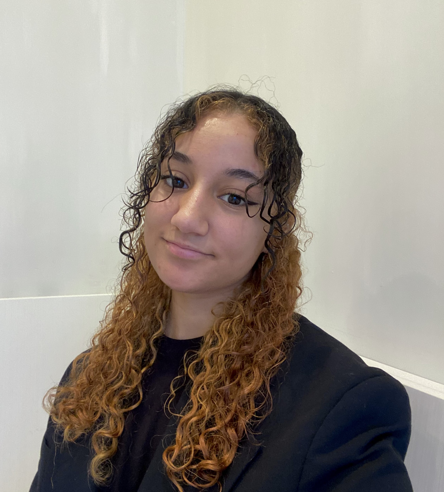

# Jihane-Y.github.io
<!DOCTYPE html>
<html lang="en">

<head>
    <meta charset="utf-8">
    <title>Jihane YAKACHE</title>
    <meta content="width=device-width, initial-scale=1.0" name="viewport">
    <meta content="Free HTML Templates" name="keywords">
    <meta content="Free HTML Templates" name="description">

    <!-- Favicon -->
    <link href="img/favicon.ico" rel="icon">

    <!-- Google Web Fonts -->
    <link rel="preconnect" href="https://fonts.gstatic.com">
    <link href="https://fonts.googleapis.com/css2?family=Roboto:wght@300;400;500;700;900&display=swap" rel="stylesheet"> 

    <!-- Font Awesome -->
    <link href="https://cdnjs.cloudflare.com/ajax/libs/font-awesome/5.10.0/css/all.min.css" rel="stylesheet">

    <!-- Libraries Stylesheet -->
    <link href="lib/owlcarousel/assets/owl.carousel.min.css" rel="stylesheet">
    <link href="lib/lightbox/css/lightbox.min.css" rel="stylesheet">

    <!-- Customized Bootstrap Stylesheet -->
    <link href="css/style.css" rel="stylesheet">
</head>

<body data-spy="scroll" data-target=".navbar" data-offset="51">
    <!-- Navbar Start -->
    <nav class="navbar fixed-top shadow-sm navbar-expand-lg bg-light navbar-light py-3 py-lg-0 px-lg-5">
        <a href="index.html" class="navbar-brand ml-lg-3">
            <h1 class="m-0 display-5">Jihane YAKACHE</h1>
        </a>
        <button type="button" class="navbar-toggler" data-toggle="collapse" data-target="#navbarCollapse">
            
        </button>
        

            

                <a href="#home" class="nav-item nav-link active">Accueil</a>
                <a href="#qualification" class="nav-item nav-link">Mes Expériences</a>
				<a href="#skill" class="nav-item nav-link">Mes Compétences</a>
                <a href="#portfolio" class="nav-item nav-link">Portfolio</a>
                <a href="#contact" class="nav-item nav-link">Contact</a>
           
    </nav>
    <!-- Navbar End -->

    <!-- Video Modal Start -->
    

        

            

                

                    <button type="button" class="close" data-dismiss="modal" aria-label="Close">
                        &times;
                    </button>        
                    <!-- 16:9 aspect ratio -->
                    

                        <iframe class="embed-responsive-item" src="" id="video"  allowscriptaccess="always" allow="autoplay"></iframe>
                    

                

            

        

    

    <!-- Video Modal End -->

    <!-- Header Start -->
    

        

            

                

                    
                

                

                    <h3 class="text-white font-weight-normal mb-3">Je suis</h3>
                    <h1 class="display-3 text-uppercase text-primary mb-2" style="-webkit-text-stroke: 2px #ffffff;">Jihane YAKACHE</h1>
                    <h1 class="typed-text-output d-inline font-weight-lighter text-white"></h1>
                    
Étudiante en Techniques de Commercialisation

                    

                        <a href="img/CV.YAKACHE.Jihane.pdf" class="btn btn-outline-light mr-5">Télécharger mon CV</a>
						<a href="img/LM.YAKACHE.Jihane.pdf" class="btn btn-outline-light mr-5">Télécharger ma Lettre de motivation</a>
                        <button type="button" class="btn-play" data-toggle="modal"
                            data-src="https://www.youtube.com/embed/DWRcNpR6Kdc" data-target="#videoModal">
                            
                        </button>
						<!-- à effacer peut etre --> 
                        <h5 class="font-weight-normal text-white m-0 ml-4 d-none d-sm-block">Play Video</h5>
                    

                

            

        

    

    <!-- Header End -->

    <!-- About Start -->
    

        

            

                <h1 class="display-1 text-uppercase text-white" style="-webkit-text-stroke: 1px #dee2e6;">à Propos</h1>
                <h1 class="position-absolute text-uppercase text-primary">à Propos de moi</h1>
            

            

                

<iframe width="100%" height="600" frameborder="0" scrolling="no" marginheight="0" marginwidth="0" src="https://maps.google.com/maps?width=100%25&amp;height=600&amp;hl=en&amp;q=99%20Av.%20d'Occitanie,%2034090%20Montpellier+(IUT%20Montpellier%20-%20Sete%20)&amp;t=&amp;z=14&amp;ie=UTF8&amp;iwloc=B&amp;output=embed"><a href="https://www.gps.ie/">gps tracker sport</a></iframe>

                

                

                    <h3 class="mb-4">Étudiante en BUT Techniques de Commercialisation à l'IUT Montpellier - Sète
				</h3>
                    
Bonjour et merci de votre visite ! 👋
Je m'appelle Jihane YAKACHE, étudiante en BUT Techniques de Commercialisation. Sur ce site, vous découvrirez mes projets, mes expériences, et mes compétences développées soigneusement au fil de mon parcours à la fois académique et professionel. N'hésitez pas à parcourir mes réalisations et à me contacter si vous souhaitez en savoir plus ou discuter d'une collaboration.

                    

                        
<h6>Nom: Jihane YAKACHE</h6>

                        
<h6>Date de Naissance: 19 mai 2005</h6>

                        
<h6>Diplome: BUT Technique de Commercialisation (Bac +2)</h6>

                        
<h6>Téléphone: (+33) 7 60 42 91 39</h6>

                        
<h6>Email: Yakache.jihane@gmail.com</h6>

                        
<h6>Adresse: Montpellier, 34090</h6>

                    

                

            

        

    

    <!-- About End -->

    <!-- Qualification Start -->
    

        

            

                <h1 class="display-1 text-uppercase text-white" style="-webkit-text-stroke: 1px #dee2e6;">Parcours</h1>
                <h1 class="position-absolute text-uppercase text-primary">Mon Parcours</h1>
            

            

                

                    <h3 class="mb-4">Ma Formation </h3>
                    

                        

                            <i class="far fa-dot-circle text-primary position-absolute" style="top: 2px; left: -32px;"></i>
                            <h5 class="font-weight-bold mb-1">BUT Techniques de Commercialisation </h5>
                            
<strong>IUT de Montpellier - France </strong> | <small>2023 à Aujourd'hui</small>

                            
 Spécialisation en Marketing Digital et e-entreprenariat, deuxième année actuellement en cours.

                        

                        

                            <i class="far fa-dot-circle text-primary position-absolute" style="top: 2px; left: -32px;"></i>
                            <h5 class="font-weight-bold mb-1">Bac Général </h5>
                            
<strong>Lycée Paul Langevin, Martigues - France</strong> | <small>2020 - 2023</small>

                            
 Spécialisation en Sciences économique et social et Anglais Monde Comtemporain. Obtention du diplome avec la mention bien.

                        
           
                    

                

                

                    <h3 class="mb-4">Mes Experiences Profesionnelles</h3>
                    

                        

                            <i class="far fa-dot-circle text-primary position-absolute" style="top: 2px; left: -32px;"></i>
                            <h5 class="font-weight-bold mb-1">Vendeuse prêt-à-porter</h5>
                            
<strong>Zara, Montpellier - France</strong> | <small>2024 à Aujourd'hui</small>

                            <li>Accueil des clients avec professionnalisme et courtoisie. </li>
 <li>Identification des besoins des clients et conseil sur les produits.</li>
 <li>Réassort des rayons et maintien de leur bonne présentation.</li>
 <li>Maintien de la propreté du magasin et des cabines d'essayage.</li>
 <li>Gestion des cabines : récupération et contrôle des articles.</li>
 <li>Fidélisation des clients et promotion des avantages du magasin.</li>
 <li>Atteinte des objectifs de vente et suivi des procédures internes</li>
                        

                        

                            <i class="far fa-dot-circle text-primary position-absolute" style="top: 2px; left: -32px;"></i>
                            <h5 class="font-weight-bold mb-1">Hôte de caisse</h5>
                            
<strong>Coop Pronto, Lausanne - Suisse</strong> | <small>2023</small>

                            <li>Accueil et service de la clientèle</li>
<li>Gestion des transactions en espèces et par carte bancaire</li>
<li>Utilisation de la caisse enregistreuse, Vérification et enregistrement des paiements</li>
<li>Maintien de l'ordre et de la propreté de la zone de caisse</li>
<li>Résolution des plaintes et des problèmes des clients avec professionnalisme</li>
<li>Assistance à la mise en rayon et facing</li>
<li>Respect des politiques de sécurité et des procédures de l'entreprise</li>

                        

                        

                            <i class="far fa-dot-circle text-primary position-absolute" style="top: 2px; left: -32px;"></i>
                            <h5 class="font-weight-bold mb-1">Vendeuse linge de maison</h5>
                            
<strong>Linvosge, Paris - France</strong> | <small>2022</small>

                            <li>Accueil des clients, réponse à leurs demandes de renseignements avec efficacité et courtoisie</li>
<li>Rangement et nettoyage du magasin et des rayons, remise en ordre des articles, réassortiment des produits, participation aux missions d'entretien des locaux</li>
<li>Ouverture, mise en rayon et commercialisation de nouveaux produits sur des présentoirs visuellement attrayants et organisés pour une stimulation optimale des ventes</li>
<li>Participation aux opérations d'inventaires Mise en rayons et réalisation de vitrines en proposant des visuels attractifs</li>
                        

                    

                

            

        

    

    <!-- Qualification End -->

    <!-- Skill Start -->
    

        

            

                <h1 class="display-1 text-uppercase text-white" style="-webkit-text-stroke: 1px #dee2e6;">Compétences</h1>
                <h1 class="position-absolute text-uppercase text-primary">Mes Compétences</h1>
            

            

                

                    

                        

                            <h6 class="font-weight-bold">Maitrise Canva</h6>
                            <h6 class="font-weight-bold">90%</h6>
                        

                        

                            

                        

                    

                    

                        

                            <h6 class="font-weight-bold">Maitrise Google Workspace</h6>
                            <h6 class="font-weight-bold">80%</h6>
                        

                        

                            

                        

                    

                    

                        

                            <h6 class="font-weight-bold">Maitrise Pack Office</h6>
                            <h6 class="font-weight-bold">80%</h6>
                        

                        

                            

                        

                    

                

                

                    

                        

                            <h6 class="font-weight-bold">Français</h6>
                            <h6 class="font-weight-bold">100%</h6>
                        

                        

                            

                        

                    

                    

                        

                            <h6 class="font-weight-bold">Anglais </h6>
                            <h6 class="font-weight-bold">95%</h6>
                        

                        

                            

                        

                    

                    

                        

                            <h6 class="font-weight-bold">Espagnol</h6>
                            <h6 class="font-weight-bold">30%</h6>
                        

                        

                            

                        

                    

                

            

        

    

    <!-- Skill End -->

    <!-- Portfolio Start -->
    

        

            

                <h1 class="display-1 text-uppercase text-white" style="-webkit-text-stroke: 1px #dee2e6;">Portefolio</h1>
                <h1 class="position-absolute text-uppercase text-primary">Mon Portfolio</h1>
            

            

                

                    <ul class="list-inline mb-4" id="portfolio-flters">
                        <li class="btn btn-sm btn-outline-primary m-1 active"  data-filter="*">Tout</li>
                        <li class="btn btn-sm btn-outline-primary m-1" data-filter=".first">Experiences</li>
                        <li class="btn btn-sm btn-outline-primary m-1" data-filter=".second">Logiciel</li>
                        <li class="btn btn-sm btn-outline-primary m-1" data-filter=".third">Réalisation</li>
                    </ul>
                

            

            

                

                    

                        
                        

                            <a href="img/Portfolio (1).png" data-lightbox="portfolio" data-title="Dans le cadre d’un projet SAE 
							(Situation d’Apprentissage et d’Évaluation) destiné au développement de nos compétences en marketing,
							nous avons réalisé une étude de marché pour la marque Magnum. À partir des critères analysés lors de cette étude, 
							nous avons conçu un produit innovant qui s’intégrerait bien au marché.">
                                <i class="fa fa-plus text-white" style="font-size: 60px;"></i>
                            </a>
							
                        

                    

                

                

                    

                        
                        

                            <a href="img/Portfolio (2).png" data-lightbox="portfolio"data-title="Dans le cadre d’un projet SAE 
							(Situation d’Apprentissage et d’Évaluation), destiné au développement de nos compétences en communication commerciale,
							nous avons créé des supports de communication pour une entreprise de bijoux située à Montpellier. Après avoir analysé les 
							supports des concurrents, nous avons conçu des plaquettes commerciales et des affiches en français et en anglais.">
                                <i class="fa fa-plus text-white" style="font-size: 60px;"></i>
                            </a>
                        

                    

                

                

                    

                        
                        

                            <a href="img/Portfolio (3).png" data-lightbox="portfolio"data-title="Dans le cadre de mes études, 
							j’ai effectué un stage destiné à développer mes compétences en vente. J’ai ainsi passé deux semaines
							dans une agence immobilière, où j’ai pu vivre des expériences concrètes : visites, rencontres avec des clients,
							prospection porte-à-porte, et surtout, observer la différence entre l’apprentissage théorique et la réalité professionnelle.">
                                <i class="fa fa-plus text-white" style="font-size: 60px;"></i>
                            </a>
                        

                    

                

                

                    

                        
                        

                            <a href="img/Portfolio (4).png" data-lightbox="portfolio"data-title="J’ai moi-même réalisé le site web sur lequel vous vous trouvez ! 
							Dans le cadre de mes études, j’ai conçu ce site de présentation en utilisant les langages HTML et CSS, avec une édition réalisée sur Notepad.
							Ce projet m’a permis de développer mes compétences techniques et d’approfondir ma compréhension des bases du développement web, une expérience 
							particulièrement enrichissante.">
                                <i class="fa fa-plus text-white" style="font-size: 60px;"></i>
                            </a>
                        

                    

                

                

                    

                        
                        

                            <a href="img/Portfolio (5).png" data-lightbox="portfolio"data-title="Dans le cadre d’une étude marketing,
							en continuité avec nos travaux de première année, nous avons créé un questionnaire à visée quantitative afin de déterminer
							comment insérer un nouveau produit, imaginé par nos soins, sur un marché. Nous nous sommes également chargés de l’administration 
							de ce dernier et avons pu récolter 256 réponses. Ce projet s’est révélé très intéressant et passionnant.">
                                <i class="fa fa-plus text-white" style="font-size: 60px;"></i>
                            </a>
                        

                    

                

                

                    

                        
                        

                            <a href="img/Portfolio (6).png" data-lightbox="portfolio"data-title="Dans le cadre d’un projet réalisé en octobre 2024, 
							j’ai conçu une maquette fictive pour le SEO d’une entreprise. Ce projet m’a permis de mettre en pratique mes connaissances 
							issues des cours de marketing et de communication digitale. J’ai trouvé particulièrement intéressant de travailler sur une 
							application concrète, dépassant ainsi le cadre purement théorique.">
                                <i class="fa fa-plus text-white" style="font-size: 60px;"></i>
                            </a>
                        

                    

                

				 

                    

                        
                        

                            <a href="img/Portfolio (7).png" data-lightbox="portfolio"data-title="Excel est un logiciel de gestion et d’analyse de données, que j'utilise
							souvent dans un contexte scolaire. Je l’emploie principalement pour traiter des données, réaliser des analyses 
							et apprendre à utiliser des formules essentielles comme les fonctions de calcul, de recherche ou de logique. Bien que ma maîtrise soit encore en développement, 
							je suis capable d’exécuter des opérations de base et des analyses simples, ce qui me permet de tirer profit de l’outil pour mes travaux académiques.">
                                <i class="fa fa-plus text-white" style="font-size: 60px;"></i>
                            </a>
                        

                    

                

				 

                    

                        
                        

                            <a href="img/Portfolio (8).png" data-lightbox="portfolio"data-title="GIMP est un logiciel libre et gratuit de 
							retouche d’images et de création graphique. Dans le cadre de mes études, j’ai eu l’occasion d’apprendre les bases
							de la retouche d’image, notamment le traitement des couleurs, les montages simples et l’utilisation des calques. En dehors du cadre scolaire, 
							je l’utilise également pour des projets personnels, comme la création de visuels ou l’édition d’images. Bien que ma maîtrise reste de niveau amateur,
							je suis à l’aise avec ses fonctionnalités principales et je continue à développer mes compétences en explorant ses nombreuses possibilités.">
                                <i class="fa fa-plus text-white" style="font-size: 60px;"></i>
                            </a>
                        

                    

                

				 

                    

                        
                        

                            <a href="img/Portfolio (9).png" data-lightbox="portfolio"data-title="Canva est une plateforme de création graphique en ligne collaborative 
							que j’utilise quotidiennement dans le cadre de mes études. Elle me permet de concevoir des outils de communication visuellement attractifs, de réaliser
							des cartes mentales structurées pour organiser mes idées, ainsi que de créer des présentations pour mes oraux. 
							j’ai développé une assez bonne maîtrise de cet outil.">
                                <i class="fa fa-plus text-white" style="font-size: 60px;"></i>
                            </a>
                        

                    

            

        

    

    <!-- Portfolio End -->

    <!-- Footer Start -->
    

        

            

                <a class="btn btn-light btn-social mr-2" href="https://www.linkedin.com/in/jihane-yakache-28665b328/"><i class="fab fa-linkedin-in"></i></a>
            

            

                
Yakache.jihane@gmail.com

                |
                
07 60 42 91 39

               
        
           
        

    

    <!-- Footer End -->

    <!-- Scroll to Bottom -->
    <i class="fa fa-2x fa-angle-down text-white scroll-to-bottom"></i>

    <!-- Back to Top -->
    <a href="#" class="btn btn-outline-dark px-0 back-to-top"><i class="fa fa-angle-double-up"></i></a>

    <!-- JavaScript Libraries -->
    
    
    
    
    
    
    
    

    <!-- Contact Javascript File -->
    
    

    <!-- Template Javascript -->
    
</body>

</html>
